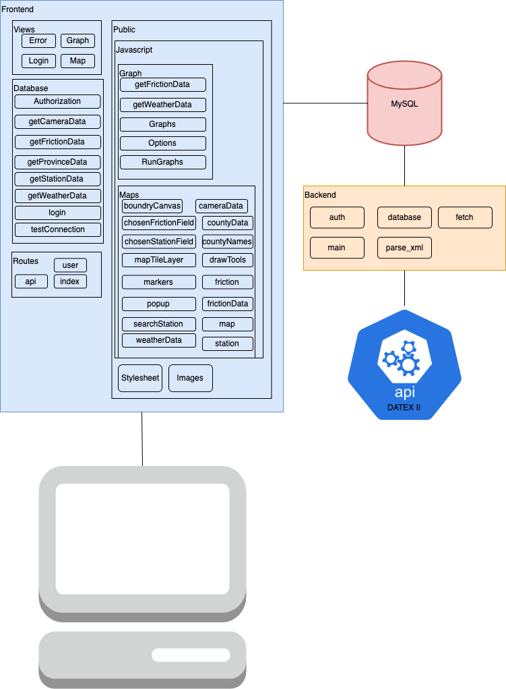

# 1 Inledning
## 1.1 Bakgrund
I detta projekt finns det mycket material att utgå från då projektet har funnits ett flertal år där flera projektgrupper har arbetat med projektet. Föregående grupper har gjort mycket av grundarbetet, där de hämtar data från Trafikverkets API lägger det på en server och sedan tar datan från servern till en hemsida/webbserver. På hemsidan visualiseras datan på en karta där det enkelt går att se alla sensorer som finns. klicka på sensorerna för att se den senaste bilden sensorn har tagit och mätdatan från sensorn. Det behov som behöver mötas är att förbättra den nuvarande lösning med till exempel felhantering även så behövs en utveckling av den nuvarande lösning. Denna utveckling är inte fastställd än men det finns ett flertal ideér såsom att implementera vägar på kartan och färger på vägarna beronde på väg temperaturen. 

## 1.2 Problembeskrivning
Projektet bygger vidare på en tidigare lösning. Trafikverket var nöjd med denna lösning och vill vidareutveckla den. Problematiken blir att ta ägandeskap av nuvarande lösning och sedan förbättra och utveckla lösningen.

## 1.3 Uppgift
Uppgiften i detta projekt består av att vidareutveckla projektet “Road condition monitoring and visualization” som har utvecklats i kursen D0020E under tidigare år. Projektet går ut på att skapa ett verktyg för aggregation och analys av data för vägförhållanden. Första steget för att kunna vidareutveckla projektet är att studera det tidigare arbetet, förstå hur de har arbetat, förstå hur deras kod hänger samman och sen även att lära sig om programmeringsspråken som de har använt. Sedan skall en intervju med områdes-experten äga rum för att reda på vilka funktioner hon önskar samt så ska den föregående gruppens backlog tas del av. Det för att få en bra uppfattning utav framtida utvecklingar vi kan implementera i projektet. Efter jul börjar utvecklingsfasen där de önskade funktionerna implementeras och testas.
 

## 1.4 Avgränsning
Projektgruppen kommer inte göra några flera moduler då dem är redan färdiga. Det är ej tänkt att göra några större ändringar i backend och databasen. Istället så skall fokuset ligga på att utveckla funktionalitet samt att förfina existerande funktioner såsom grafer.

  
  

# 2 Systemdesign
Figuren nedan är ett modul-diagram över nuvarande lösning. Då uppgiften är att förbättra/bygga på denna lösning så kommer den ha samma struktur fast med några ändrade detaljer. Diagrammet beskriver hur en backend kommunicerar med trafikverkets API Datex II och fyller i en databas. APIet är skrivet i programmeringsspråket Rust. Frontend vilket är skrivet i JavaScript kommunicerar med databasen och använder sig av paket som OpenStreetMap för att visa en karta över Sverige.

### 4.2.2 Regressionsrisker
En regression är då en av systemets funktioner upphör att fungera i samband med att kod i systemet ändrats. Det finns tre huvudsakliga typer av regression som är aktuella för projektet.

Local, remote och unmasked. 

* Local: När en bugg upptäcks i den kod som uppdateras.

* Remote: När en bugg upptäcks i en annan del än den som blir uppdaterad.

* Unmasked: När en bugg som redan existerar blir ett problem på grund av den nya och uppdaterade koden.

Den största och mest uppenbara risken utifall det skulle ske en regression är att systemet havererar. Hemsidan, servern eller databasen kan sluta funktionera som planerat och därmed göra hemsidan obruklig eller ha nedsatt funktionalitet. För att motverka det så bör man fokusera på de följande områdena:

* Kodstycken där problem ofta uppstår 

* Kod som nyligen förändrats.  

* De mest fundamentala delarna av systemet

Det här systemets kritiska delar är kartvyn och databasen. Ifall man ej kan se kartan så kommer inte systemet ha möjlighet att förmedla datan till användaren. Det andra känsliga området är databasen, ifall databasen ej lyckas hämta data från Datex så kommer användaren inte ha möjlighet att analysera någon information. I praktiken bör kartvyn fungera utan trafikinformationen men oväntade problem kan eventuellt uppstå.

### 4.2.3 Strategi för regressiontester 

#### 4.2.3.1 
* Spårbarhet(traceability) handlar om att välja tester beroende på beteendet av systemet. Krav och design tillsammans med dokumenterade kvalitets risker används för att veta vilka funktioner som ska testas. Spårbarhets-analys används för att ha kontroll på vilken del av systemet som täcks upp av ett test. Spårbarhet kan användas i projektet för att säkerställa att våra lösningar har fixat problemet.

* Förändringsanalys (Change impact analysis) är en nödvändig aktivitet för underhåll av mjukvara, där man analyserar vilka funktioner som påverkas av förändringarna i mjukvaran och endast testar det som påverkas. Analysen sker ofta via att man tittar på den strukturella förklaringen (klass- och moduldiagram) av systemet och följer hur förändringar rinner vidare genom systemet.

* Bedömning av kvalitetsrisker (Quality risk analysis) är när tester väljs beroende på vad som är viktigast för företaget/systemet. Funktioner som är kopplat till t.ex. personalsäkerhet eller kunders nöjdhet kan testas mer omfattande än andra mindre viktiga funktioner.

* Tvärfunktionell testning (Cross-functional testing) är när man testar kombinationer av funktioner som inte borde påverka varandra. Detta tillvägagångssätt kan användas till utforskande-, system-, acceptans- och enhetstester. Möjliga sätt att applicera tvärfunktionell testning kan vara att t.ex. Täcka stora områden av systemet för att göra initiala svepningar för att leta efter buggar, som sedan kan följas upp av mer fokuserade områden där buggar tidigare har upptäckts med målet att intensifiera tester i områden där nya buggar hittas.

#### 4.2.3.2 Regressionstest Applicering
Förändringsanalys vid små förändringar. kvalitetsrisker pga att trafikverkets data är känslig. Och även tvärfunktionell testning vid större systemförändringar eller sprintavslut.

### 4.2.4
Trafikverket skickar friktions-data månadsvis till individer delaktiga i projektet. Datan som skickas ska kunna laddas upp till servern via hemsidan.

**Krav:** För att testet ska kunna genomföras så ska följande kriterier vara uppfyllda
* Friktions-data ska kunna presenteras grafiskt
* Ludds DUST server ska vara uppsatt
* Trafikverket ska ha skickat Friktions-data

#### 4.2.4.1 Unit Testing
Givet en XML-Fil omvandlar till korrekt SQL-Query. 
Testet genomförs med en XML-Fil och en förväntad output, detta repeteras för 1 års av friktions-data.
Målet med testet är att testa en liten del av systemet. Kontrollera funtionalliteten hos delen externt. 
**Automatisering:** Testet gynnas inte av automatiseringm, beslutet att göra testet manuelt gjordes.
**Estimerad test utveckling:** Testet är enkelt och går fort att skapa. 

#### 4.2.4.1 System Testing
En XML-Fil skickas från en klient till servern och ska sen uppdatera vyn och visa de nya datapunkterna. I detta fall kommer de nya datapunkterna vara friktions datan från tre olika aktörer. De tre olika aktörernas data ska kunna filtreras så att klienten ska kunna välja vilken vy och vilka/vilken aktörs data de vill se.
Målet med testet är att testa en stor del av systemt. Kontrollera funtionalliteten och hastigheten hos delen externt.
**Automatisering:** Då systemtesting är omfattande kan automatisering vara fördelaktikt. 
**Estimerad test utveckling:** Ett systemtest kan vara omfattande och ta lång tid att utveckla. 
